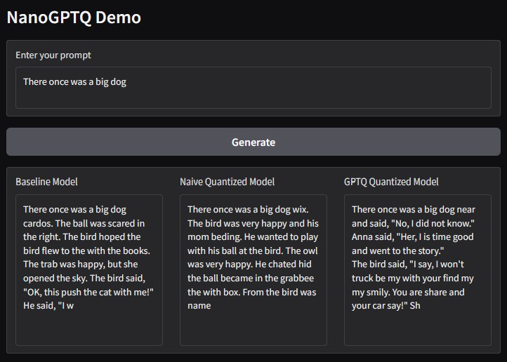

# Quantization of NanoGPT

This repo contains a project for the lecture 194.077 Applied Deep Learning.

**Topic:** Post‑training int8 weight quantization of a small autoregressive transformer.

**Type:** Bring‑your‑own‑method.

<p align="center">
  
</p>

## Getting Started

### 1. Clone the repository
   ```bash
   git clone -b main https://github.com/p0017/11918494_nanoGPTQ.git
   cd 11918494_nanoGPTQ
   ```

### 2. Install required packages
Set up a *conda* environment. This can take a few minutes.
   ```bash
   conda env create -f environment.yml
   conda activate nanoGPTQ
   ```

### 4. Optionally run the data preprocessing
If you want to use custom data.
   ```bash
   python ./src/data_preprocessing.py
   ```

### 5. Optionally train a model
If you want to do your own training. All training parameters can be set in `./src/config.py`
   ```bash
   python ./src/train.py
   ```

### 6. Optionally quantize
If you want to quantize your trained model. Either using naive quantization or GPTQ. All quantization parameters can be set in `./src/config.py`
   ```bash
   python ./src/quantize.py
   ```

### 7. Optionally sample from a model
If you want to sample from a trained or quantized model. All sampling parameters can be set in `./src/config.py`
   ```bash
   python ./src/sample.py
   ```

### 8. Optionally evaluate the models
If you want to compare a baseline model to its quantized variants. All evaluation parameters can be set in `./src/config.py`
   ```bash
   python ./src/evaluate.py
   ```

### 9. Run the local demo
All demo parameters can be set in `./src/config.py`
   ```bash
   python ./src/demo.py
   ```

## Motivation

**Problem:** Large models have millions to billions of parameters/weights, consuming a large amount of GPU memory and computational resources for inference, limiting their application in resource-constrained settings.

**Solution:** Post-training quantization reduces the number of bits per weight, significantly lowering memory usage. This enables deployment on edge devices and paves the way for accelerated inference on GPUs that support low-precision operations, while preserving most of the model's performance. All of this is achieved without the need for retraining the model.

## Approach

I re-implemented a small ~2-3 M parameter autoregressive transformer based on NanoGPT, trained it once on a 10 MB subset of the TinyStories V2 text dataset, and implemented two post‑training integer (int8) weight quantization techniques.

1. **Naive rounding quantization:** Rounds each weight to the nearest representable int8 value.
2. **Hessian‑aware quantization (GPTQ-like):** Iteratively rounds weights one by one and adjusts all remaining weights using a Hessian approximation computed on a small calibration set.

Both quantized model variants were then compared to the floating‑point (fp32) baseline model. All computations were done on a Nvidia GTX 960M (4 GB VRAM).

## Dataset

**Dataset:** A 10 MB subset of TinyStories V2, a corpus of synthetically generated (by GPT-4) short stories that only use a small vocabulary.

**Preprocessing:** Simple char tokenization and train/validation splitting.

**Error Metric:** Perplexity.

## Demo application

**Form:** A local Python web app with Gradio.

**Features:** Given a user prompt, the demo generates and displays responses from the three model variants side by side for easy comparison.

## References

1. Hassibi & Stork — *Optimal Brain Surgeon* — [NeurIPS 1992](https://papers.neurips.cc/paper_files/paper/1992/hash/303ed4c69846ab36c2904d3ba8573050-Abstract.html)
2. Frantar et al. — *GPTQ: Accurate Post‑Training Quantization for Generative Pre‑trained Transformers* — [ICLR 2023](https://openreview.net/forum?id=tcbBPnfwxS)
3. Karpathy — *nanoGPT* — [GitHub Repo](https://github.com/karpathy/nanoGPT)
4. Eldan & Li — *TinyStories: How Small Can Language Models Be and Still Speak Coherent English?* — [arXiv](https://arxiv.org/abs/2305.07759)

## Work Breakdown

| Task                                        | Expected (h) | Actual (h) | Difference (h) |
|---------------------------------------------|:------------:|:----------:|:--------------:|
| Repo setup                                  |      3       |    0.5     |      2.5       |
| Dataset collection & preprocessing          |      3       |    1.5     |      1.5       |
| Implement NanoGPT & sanity training runs    |      8       |    11      |     -3.0       |
| Full baseline training                      |     12       |    11      |      1.0       |
| Implement naive weight quantization         |      4       |     2      |      2.0       |
| Implement Hessian-aware weight quantization |      8       |    8.5     |     -0.5       |
| Evaluate model variants and create demo     |      7       |    4.5     |      2.5       |
| Report writing & presentation prep          |     10       |    3.5     |      6.5       |
| **Total**                                   | **55**       | **42.5**   |   **12.5**     |

## Project Structure

```
11918494_nanoGPTQ/
├── environment.yml                          # Conda environment specification
│
├── checkpoints/                             
│   ├── tinystories_6x192.pt                 # Baseline floating-point model 
│   ├── tinystories_6x192_quantized_gptq.pt  # GPTQ quantized model
│   └── tinystories_6x192_quantized_naive.pt # Naive quantized model
│
├── data/                                   
│   ├── tinystories.txt                      # Raw TinyStories text
│   ├── tinystories_train.bin                # Encoded training data
│   ├── tinystories_val.bin                  # Encoded validation data
│   └── tinystories_test.bin                 # Encoded test data
│
├── src/                             
│   ├── config.py                            # All configuration parameters
│   ├── data_preprocessing.py                # Data loading and preprocessing
│   ├── demo.py                              # Demo app
│   ├── evaluate.py                          # Perplexity evaluation script
│   ├── model.py                             # GPT model
│   ├── quantize.py                          # Quantization script
│   ├── sample.py                            # Sampling script
│   ├── train.py                             # Training script
│   └── __init__.py                          # src package init
│ 
├── figures/                                 # Figures and plots
└── tests/                                   # Unit tests

```

## Results

The baseline model was able to predict full and correct words, often generating even half-sentences that are accurate, and it uses punctuation marks appropriately. In contrast, the naively quantized model frequently predicted incorrect or nonexistent words and misused symbols, while the GPTQ version eliminated these errors and produced outputs similar to the baseline. 
This qualitative difference is also reflected in the perplexity results. This qualitative difference is also reflected in the perplexity results. Integer quatization reduced the model size by 90%, from 31.9 MB to 2.9 MB. The naive quantization led to a slightly worse perplexity than the baseline, while the Hessian-aware quantization was able to match the baseline perplexity.

| Model Variant   | Perplexity | Model Size |
|-----------------|:----------:|:----------:|
| **Baseline**    | 2.76     | 31.9 MB    |
| **Naive**       | 2.78     | 2.9 MB     |
| **GPTQ**        | 2.76     | 2.9 MB     |


